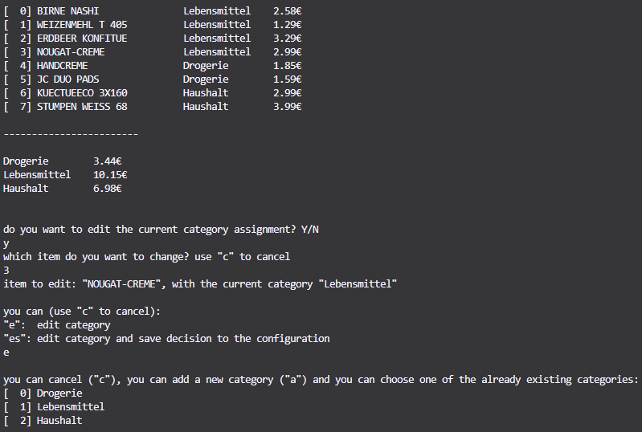

# REWE e-Bon Categorizer

This is a simple python-script for the console that reads and parses a REWE e-Bon (PDF format) and categorizes the items.  
The user has the ability to edit the (automatic) categorization from the console.  
  
Used categories for bought items can be saved into a local JSON-based configuration so that future executions will take these assignments into account.  
  
This is helpful for users that want to add bought items into a housekeeping book (i.e. Finanzguru) or some other applications.



## 🛠️ Requirements

You need Python version 3 to run this script.

## 🌐 Usage

First time you want to run this script, you have to run

```powershell
pip install --no-cache-dir -r .src\requirements.txt
```

then you can run

```powershell
python .\py-ebon.py
```

to start the script.  
You simply have to follow the instructions in the console.
